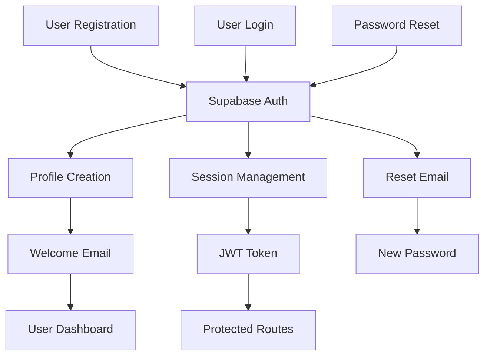

# 🔐 Authentication Documentation

## Overview
আমার হাদিস application Supabase Auth ব্যবহার করে comprehensive authentication system implement করেছে। এটি secure, scalable এবং user-friendly।

## 🏗️ Authentication Architecture

### Flow Diagram


## 🔑 Authentication Methods

### 1. Email/Password Authentication
Primary authentication method using email and password.

**Registration Flow:**
```typescript
// AuthProvider.tsx
const signUp = async (email: string, password: string, fullName: string) => {
  const { data, error } = await supabase.auth.signUp({
    email,
    password,
    options: {
      data: {
        full_name: fullName,
      }
    }
  })

  // Send welcome email
  if (data.user && !error) {
    await fetch('/api/email/welcome', {
      method: 'POST',
      headers: { 'Content-Type': 'application/json' },
      body: JSON.stringify({
        userEmail: email,
        userName: fullName
      })
    })
  }

  return { data, error }
}
```

**Login Flow:**
```typescript
const signIn = async (email: string, password: string) => {
  const { data, error } = await supabase.auth.signInWithPassword({
    email,
    password,
  })
  return { data, error }
}
```

### 2. Social Authentication (Future)
Plans for Google, Facebook, and Apple sign-in.

```typescript
// Future implementation
const signInWithGoogle = async () => {
  const { data, error } = await supabase.auth.signInWithOAuth({
    provider: 'google',
    options: {
      redirectTo: `${window.location.origin}/auth/callback`
    }
  })
  return { data, error }
}
```

## 👤 User Roles & Permissions

### Role Hierarchy
```typescript
enum UserRole {
  USER = 'user',           // Basic user access
  MODERATOR = 'moderator', // Content moderation
  ADMIN = 'admin',         // Full system access
  SCHOLAR = 'scholar'      // Religious authority
}
```

### Permission Matrix
| Feature | User | Moderator | Admin | Scholar |
|---------|------|-----------|-------|---------|
| Read Hadith | ✅ | ✅ | ✅ | ✅ |
| Favorite Hadith | ✅ | ✅ | ✅ | ✅ |
| Submit Contributions | ✅ | ✅ | ✅ | ✅ |
| Review Contributions | ❌ | ✅ | ✅ | ✅ |
| Verify Hadith | ❌ | ❌ | ✅ | ✅ |
| User Management | ❌ | ❌ | ✅ | ❌ |
| System Settings | ❌ | ❌ | ✅ | ❌ |

### Role-based Access Control
```typescript
// hooks/usePermissions.ts
export function usePermissions() {
  const { user, profile } = useAuth()
  
  const can = useCallback((action: string, resource?: string) => {
    if (!profile) return false
    
    const permissions = {
      'user': ['read', 'favorite', 'contribute'],
      'moderator': ['read', 'favorite', 'contribute', 'review'],
      'admin': ['*'], // All permissions
      'scholar': ['read', 'favorite', 'contribute', 'review', 'verify']
    }
    
    const userPermissions = permissions[profile.role] || []
    return userPermissions.includes('*') || userPermissions.includes(action)
  }, [profile])
  
  return { can, role: profile?.role }
}
```

## 🛡️ Security Features

### 1. Row Level Security (RLS)
Database-level security policies.

```sql
-- Users can only access their own data
CREATE POLICY "Users can view own profile" ON profiles
    FOR SELECT USING (auth.uid() = id);

CREATE POLICY "Users can update own profile" ON profiles
    FOR UPDATE USING (auth.uid() = id);

-- Users can only see their own interactions
CREATE POLICY "Users can view own interactions" ON user_hadith_interactions
    FOR SELECT USING (auth.uid() = user_id);

-- Public content is viewable by everyone
CREATE POLICY "Verified hadith are viewable by everyone" ON hadith
    FOR SELECT USING (status = 'verified');
```

### 2. JWT Token Management
```typescript
// lib/supabase.ts
export const supabase = createClient(
  process.env.NEXT_PUBLIC_SUPABASE_URL!,
  process.env.NEXT_PUBLIC_SUPABASE_ANON_KEY!,
  {
    auth: {
      autoRefreshToken: true,
      persistSession: true,
      detectSessionInUrl: true
    }
  }
)
```

### 3. Route Protection
```typescript
// middleware.ts
export async function middleware(request: NextRequest) {
  const { supabase, response } = createMiddlewareClient({ req: request })
  
  const { data: { session } } = await supabase.auth.getSession()
  
  // Protected routes
  const protectedPaths = ['/profile', '/favorites', '/contribute']
  const isProtectedPath = protectedPaths.some(path => 
    request.nextUrl.pathname.startsWith(path)
  )
  
  if (isProtectedPath && !session) {
    const redirectUrl = new URL('/auth/login', request.url)
    redirectUrl.searchParams.set('redirectTo', request.nextUrl.pathname)
    return NextResponse.redirect(redirectUrl)
  }
  
  return response
}
```

### 4. API Route Protection
```typescript
// app/api/user/profile/route.ts
export async function GET(request: Request) {
  const supabase = createRouteHandlerClient({ cookies })
  
  const { data: { session }, error } = await supabase.auth.getSession()
  
  if (!session) {
    return NextResponse.json(
      { error: 'Unauthorized' },
      { status: 401 }
    )
  }
  
  // Fetch user profile
  const { data: profile } = await supabase
    .from('profiles')
    .select('*')
    .eq('id', session.user.id)
    .single()
  
  return NextResponse.json({ profile })
}
```

## 🔄 Session Management

### 1. Auth Context Provider
```typescript
// providers/AuthProvider.tsx
export function AuthProvider({ children }: { children: React.ReactNode }) {
  const [user, setUser] = useState<User | null>(null)
  const [profile, setProfile] = useState<Profile | null>(null)
  const [loading, setLoading] = useState(true)

  useEffect(() => {
    // Get initial session
    supabase.auth.getSession().then(({ data: { session } }) => {
      setUser(session?.user ?? null)
      if (session?.user) {
        fetchProfile(session.user.id)
      }
      setLoading(false)
    })

    // Listen for auth changes
    const { data: { subscription } } = supabase.auth.onAuthStateChange(
      async (event, session) => {
        setUser(session?.user ?? null)
        
        if (session?.user) {
          await fetchProfile(session.user.id)
        } else {
          setProfile(null)
        }
        
        setLoading(false)
      }
    )

    return () => subscription.unsubscribe()
  }, [])

  return (
    <AuthContext.Provider value={{
      user,
      profile,
      loading,
      signUp,
      signIn,
      signOut,
      updateProfile
    }}>
      {children}
    </AuthContext.Provider>
  )
}
```

### 2. Session Persistence
```typescript
// Automatic session refresh
useEffect(() => {
  const refreshSession = async () => {
    const { data: { session } } = await supabase.auth.refreshSession()
    if (session) {
      setUser(session.user)
    }
  }

  // Refresh every 50 minutes (tokens expire in 1 hour)
  const interval = setInterval(refreshSession, 50 * 60 * 1000)
  
  return () => clearInterval(interval)
}, [])
```

## 📧 Email Integration

### 1. Welcome Email
```typescript
// Triggered after successful registration
const sendWelcomeEmail = async (userEmail: string, userName: string) => {
  await fetch('/api/email/welcome', {
    method: 'POST',
    headers: { 'Content-Type': 'application/json' },
    body: JSON.stringify({ userEmail, userName })
  })
}
```

### 2. Password Reset
```typescript
const resetPassword = async (email: string) => {
  const { error } = await supabase.auth.resetPasswordForEmail(email, {
    redirectTo: `${window.location.origin}/auth/reset-password`
  })
  
  if (error) throw error
  
  return { message: 'Password reset email sent' }
}
```

### 3. Email Verification
```typescript
// Email verification is handled automatically by Supabase
const resendVerification = async () => {
  const { error } = await supabase.auth.resend({
    type: 'signup',
    email: user?.email!
  })
  
  if (error) throw error
}
```

## 🔒 Password Security

### 1. Password Requirements
```typescript
const passwordSchema = z.string()
  .min(8, 'Password must be at least 8 characters')
  .regex(/[A-Z]/, 'Password must contain at least one uppercase letter')
  .regex(/[a-z]/, 'Password must contain at least one lowercase letter')
  .regex(/[0-9]/, 'Password must contain at least one number')
  .regex(/[^A-Za-z0-9]/, 'Password must contain at least one special character')
```

### 2. Password Strength Indicator
```tsx
export function PasswordStrengthIndicator({ password }: { password: string }) {
  const strength = calculatePasswordStrength(password)
  
  return (
    <div className="mt-2">
      <div className="flex gap-1">
        {[1, 2, 3, 4].map((level) => (
          <div
            key={level}
            className={cn(
              "h-2 flex-1 rounded",
              strength >= level ? "bg-green-500" : "bg-gray-200"
            )}
          />
        ))}
      </div>
      <p className="text-sm text-gray-600 mt-1">
        Password strength: {getStrengthLabel(strength)}
      </p>
    </div>
  )
}
```

## 🚨 Error Handling

### 1. Authentication Errors
```typescript
const handleAuthError = (error: AuthError) => {
  const errorMessages = {
    'invalid_credentials': 'ইমেইল বা পাসওয়ার্ড ভুল',
    'email_already_exists': 'এই ইমেইল দিয়ে আগেই অ্যাকাউন্ট তৈরি হয়েছে',
    'weak_password': 'পাসওয়ার্ড যথেষ্ট শক্তিশালী নয়',
    'email_not_confirmed': 'ইমেইল যাচাই করুন',
    'too_many_requests': 'অনেক বেশি চেষ্টা। কিছুক্ষণ পর আবার চেষ্টা করুন'
  }
  
  return errorMessages[error.message] || 'একটি ত্রুটি ঘটেছে'
}
```

### 2. Network Error Handling
```typescript
const withRetry = async (fn: () => Promise<any>, retries = 3) => {
  for (let i = 0; i < retries; i++) {
    try {
      return await fn()
    } catch (error) {
      if (i === retries - 1) throw error
      await new Promise(resolve => setTimeout(resolve, 1000 * (i + 1)))
    }
  }
}
```

## 📱 Mobile Authentication

### 1. Biometric Authentication (Future)
```typescript
// Future implementation for mobile app
const authenticateWithBiometrics = async () => {
  const result = await LocalAuthentication.authenticateAsync({
    promptMessage: 'আমার হাদিসে প্রবেশ করুন',
    fallbackLabel: 'পাসওয়ার্ড ব্যবহার করুন'
  })
  
  return result.success
}
```

### 2. Device Registration
```typescript
const registerDevice = async (deviceInfo: DeviceInfo) => {
  const { data, error } = await supabase
    .from('user_devices')
    .insert({
      user_id: user.id,
      device_id: deviceInfo.id,
      device_name: deviceInfo.name,
      platform: deviceInfo.platform
    })
  
  return { data, error }
}
```

## 🔍 Audit & Monitoring

### 1. Login Tracking
```typescript
const trackLogin = async (userId: string, metadata: any) => {
  await supabase
    .from('auth_logs')
    .insert({
      user_id: userId,
      action: 'login',
      ip_address: metadata.ip,
      user_agent: metadata.userAgent,
      timestamp: new Date().toISOString()
    })
}
```

### 2. Security Events
```typescript
const logSecurityEvent = async (event: SecurityEvent) => {
  await supabase
    .from('security_events')
    .insert({
      user_id: event.userId,
      event_type: event.type,
      severity: event.severity,
      details: event.details,
      timestamp: new Date().toISOString()
    })
}
```

## 🧪 Testing Authentication

### 1. Unit Tests
```typescript
// __tests__/auth.test.ts
describe('Authentication', () => {
  test('should sign up user successfully', async () => {
    const mockUser = {
      email: 'test@example.com',
      password: 'TestPass123!',
      fullName: 'Test User'
    }
    
    const result = await signUp(mockUser.email, mockUser.password, mockUser.fullName)
    
    expect(result.data.user).toBeDefined()
    expect(result.error).toBeNull()
  })
  
  test('should handle invalid credentials', async () => {
    const result = await signIn('invalid@email.com', 'wrongpassword')
    
    expect(result.error).toBeDefined()
    expect(result.error.message).toBe('invalid_credentials')
  })
})
```

### 2. Integration Tests
```typescript
// __tests__/auth-flow.test.ts
describe('Authentication Flow', () => {
  test('complete registration flow', async () => {
    // 1. Register user
    const signUpResult = await signUp('test@example.com', 'TestPass123!', 'Test User')
    expect(signUpResult.data.user).toBeDefined()
    
    // 2. Verify profile creation
    const profile = await fetchProfile(signUpResult.data.user.id)
    expect(profile.email).toBe('test@example.com')
    
    // 3. Check welcome email sent
    expect(mockEmailService.sendWelcomeEmail).toHaveBeenCalled()
  })
})
```

---

এই authentication system enterprise-grade security প্রদান করে এবং user experience এর সাথে security এর perfect balance maintain করে।
