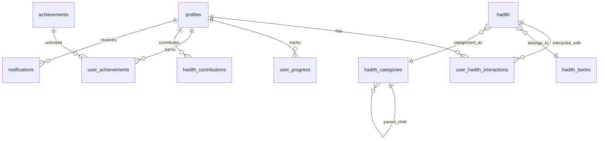

# 🗄️ Database Schema Documentation

## Overview
আমার হাদিস application এর database schema PostgreSQL (Supabase) এ design করা হয়েছে। এটি scalable, secure, এবং performance-optimized।

## 📊 Schema Diagram



## 🏗️ Core Tables

### 1. profiles (User Management)
```sql
CREATE TABLE profiles (
    id UUID REFERENCES auth.users(id) PRIMARY KEY,
    email TEXT NOT NULL,
    full_name TEXT,
    username TEXT UNIQUE,
    avatar_url TEXT,
    role user_role DEFAULT 'user',
    bio TEXT,
    location TEXT,
    website TEXT,
    is_verified BOOLEAN DEFAULT FALSE,
    streak_count INTEGER DEFAULT 0,
    total_hadith_read INTEGER DEFAULT 0,
    total_contributions INTEGER DEFAULT 0,
    points INTEGER DEFAULT 0,
    level INTEGER DEFAULT 1,
    preferred_language TEXT DEFAULT 'bn',
    notification_settings JSONB DEFAULT '{"email": true, "push": true, "prayer_reminders": true}',
    privacy_settings JSONB DEFAULT '{"profile_public": true, "progress_public": true}',
    created_at TIMESTAMP WITH TIME ZONE DEFAULT NOW(),
    updated_at TIMESTAMP WITH TIME ZONE DEFAULT NOW()
);
```

**Fields Explanation:**
- `id`: UUID from Supabase auth.users
- `role`: ENUM (user, moderator, admin, scholar)
- `streak_count`: Consecutive days of reading
- `points`: Gamification points
- `level`: User level (1-6)
- `notification_settings`: JSON preferences
- `privacy_settings`: JSON privacy controls

### 2. hadith (Main Content)
```sql
CREATE TABLE hadith (
    id UUID DEFAULT uuid_generate_v4() PRIMARY KEY,
    hadith_number TEXT,
    book_id UUID REFERENCES hadith_books(id),
    category_id UUID REFERENCES hadith_categories(id),
    chapter_arabic TEXT,
    chapter_bangla TEXT,
    chapter_english TEXT,
    text_arabic TEXT NOT NULL,
    text_bangla TEXT NOT NULL,
    text_english TEXT,
    text_urdu TEXT,
    narrator TEXT,
    grade TEXT,
    reference TEXT,
    explanation TEXT,
    keywords TEXT[],
    difficulty_level difficulty_level DEFAULT 'beginner',
    status hadith_status DEFAULT 'pending',
    audio_url TEXT,
    contributed_by UUID REFERENCES profiles(id),
    verified_by UUID REFERENCES profiles(id),
    verification_notes TEXT,
    view_count INTEGER DEFAULT 0,
    like_count INTEGER DEFAULT 0,
    share_count INTEGER DEFAULT 0,
    is_featured BOOLEAN DEFAULT FALSE,
    is_daily_special BOOLEAN DEFAULT FALSE,
    created_at TIMESTAMP WITH TIME ZONE DEFAULT NOW(),
    updated_at TIMESTAMP WITH TIME ZONE DEFAULT NOW()
);
```

**Key Features:**
- Multi-language support (Arabic, Bengali, English, Urdu)
- Community contribution system
- Verification workflow
- Analytics tracking (views, likes, shares)
- Featured content system

### 3. hadith_books (Reference Books)
```sql
CREATE TABLE hadith_books (
    id UUID DEFAULT uuid_generate_v4() PRIMARY KEY,
    name_arabic TEXT,
    name_bangla TEXT NOT NULL,
    name_english TEXT,
    name_urdu TEXT,
    author_arabic TEXT,
    author_bangla TEXT,
    author_english TEXT,
    description TEXT,
    total_hadith INTEGER DEFAULT 0,
    is_active BOOLEAN DEFAULT TRUE,
    created_at TIMESTAMP WITH TIME ZONE DEFAULT NOW()
);
```

**Sample Books:**
- সহীহ বুখারী (Sahih al-Bukhari)
- সহীহ মুসলিম (Sahih Muslim)
- সুনানে আবু দাউদ (Sunan Abu Dawood)
- জামে তিরমিযী (Jami at-Tirmidhi)

### 4. hadith_categories (Topics)
```sql
CREATE TABLE hadith_categories (
    id UUID DEFAULT uuid_generate_v4() PRIMARY KEY,
    name_arabic TEXT,
    name_bangla TEXT NOT NULL,
    name_english TEXT,
    name_urdu TEXT,
    description TEXT,
    icon TEXT,
    color TEXT,
    parent_id UUID REFERENCES hadith_categories(id),
    sort_order INTEGER DEFAULT 0,
    is_active BOOLEAN DEFAULT TRUE,
    created_at TIMESTAMP WITH TIME ZONE DEFAULT NOW()
);
```

**Sample Categories:**
- ঈমান ও আকীদা (Faith and Belief)
- নামাজ (Prayer)
- যাকাত (Zakat)
- রোজা (Fasting)
- হজ্জ (Hajj)

## 🔗 Relationship Tables

### 5. user_hadith_interactions (User Activity)
```sql
CREATE TABLE user_hadith_interactions (
    id UUID DEFAULT uuid_generate_v4() PRIMARY KEY,
    user_id UUID REFERENCES profiles(id) ON DELETE CASCADE,
    hadith_id UUID REFERENCES hadith(id) ON DELETE CASCADE,
    is_read BOOLEAN DEFAULT FALSE,
    is_favorited BOOLEAN DEFAULT FALSE,
    is_memorized BOOLEAN DEFAULT FALSE,
    rating INTEGER CHECK (rating >= 1 AND rating <= 5),
    notes TEXT,
    read_at TIMESTAMP WITH TIME ZONE,
    favorited_at TIMESTAMP WITH TIME ZONE,
    memorized_at TIMESTAMP WITH TIME ZONE,
    created_at TIMESTAMP WITH TIME ZONE DEFAULT NOW(),
    updated_at TIMESTAMP WITH TIME ZONE DEFAULT NOW(),
    UNIQUE(user_id, hadith_id)
);
```

### 6. user_progress (Daily Tracking)
```sql
CREATE TABLE user_progress (
    id UUID DEFAULT uuid_generate_v4() PRIMARY KEY,
    user_id UUID REFERENCES profiles(id) ON DELETE CASCADE,
    date DATE NOT NULL,
    hadith_read_count INTEGER DEFAULT 0,
    time_spent_minutes INTEGER DEFAULT 0,
    streak_maintained BOOLEAN DEFAULT FALSE,
    achievements_unlocked TEXT[],
    created_at TIMESTAMP WITH TIME ZONE DEFAULT NOW(),
    UNIQUE(user_id, date)
);
```

## 🏆 Gamification Tables

### 7. achievements (Achievement System)
```sql
CREATE TABLE achievements (
    id UUID DEFAULT uuid_generate_v4() PRIMARY KEY,
    name_bangla TEXT NOT NULL,
    name_english TEXT,
    description_bangla TEXT,
    description_english TEXT,
    icon TEXT,
    badge_color TEXT,
    criteria JSONB NOT NULL,
    points_reward INTEGER DEFAULT 0,
    is_active BOOLEAN DEFAULT TRUE,
    created_at TIMESTAMP WITH TIME ZONE DEFAULT NOW()
);
```

**Sample Achievements:**
- প্রথম পদক্ষেপ (First Steps) - 10 points
- নিয়মিত পাঠক (Regular Reader) - 50 points
- জ্ঞান অন্বেষী (Knowledge Seeker) - 100 points

### 8. user_achievements (User Unlocked Achievements)
```sql
CREATE TABLE user_achievements (
    id UUID DEFAULT uuid_generate_v4() PRIMARY KEY,
    user_id UUID REFERENCES profiles(id) ON DELETE CASCADE,
    achievement_id UUID REFERENCES achievements(id) ON DELETE CASCADE,
    earned_at TIMESTAMP WITH TIME ZONE DEFAULT NOW(),
    UNIQUE(user_id, achievement_id)
);
```

## 🔔 Notification System

### 9. notifications (System Notifications)
```sql
CREATE TABLE notifications (
    id UUID DEFAULT uuid_generate_v4() PRIMARY KEY,
    user_id UUID REFERENCES profiles(id) ON DELETE CASCADE,
    type TEXT NOT NULL,
    title TEXT NOT NULL,
    message TEXT NOT NULL,
    data JSONB,
    is_read BOOLEAN DEFAULT FALSE,
    created_at TIMESTAMP WITH TIME ZONE DEFAULT NOW()
);
```

## 🕌 Islamic Features

### 10. prayer_reminders (Prayer Time Notifications)
```sql
CREATE TABLE prayer_reminders (
    id UUID DEFAULT uuid_generate_v4() PRIMARY KEY,
    user_id UUID REFERENCES profiles(id) ON DELETE CASCADE,
    prayer_name TEXT NOT NULL,
    reminder_time TIME NOT NULL,
    is_active BOOLEAN DEFAULT TRUE,
    timezone TEXT DEFAULT 'Asia/Dhaka',
    created_at TIMESTAMP WITH TIME ZONE DEFAULT NOW()
);
```

### 11. daily_hadith_schedule (Daily Content Planning)
```sql
CREATE TABLE daily_hadith_schedule (
    id UUID DEFAULT uuid_generate_v4() PRIMARY KEY,
    date DATE NOT NULL UNIQUE,
    hadith_ids UUID[] NOT NULL,
    theme TEXT,
    special_occasion TEXT,
    created_by UUID REFERENCES profiles(id),
    created_at TIMESTAMP WITH TIME ZONE DEFAULT NOW()
);
```

## 🤝 Community Features

### 12. hadith_contributions (Community Submissions)
```sql
CREATE TABLE hadith_contributions (
    id UUID DEFAULT uuid_generate_v4() PRIMARY KEY,
    contributor_id UUID REFERENCES profiles(id) ON DELETE CASCADE,
    hadith_data JSONB NOT NULL,
    status contribution_status DEFAULT 'pending',
    reviewer_id UUID REFERENCES profiles(id),
    review_notes TEXT,
    reviewed_at TIMESTAMP WITH TIME ZONE,
    created_at TIMESTAMP WITH TIME ZONE DEFAULT NOW()
);
```

### 13. hadith_ratings (Community Quality Control)
```sql
CREATE TABLE hadith_ratings (
    id UUID DEFAULT uuid_generate_v4() PRIMARY KEY,
    user_id UUID REFERENCES profiles(id) ON DELETE CASCADE,
    hadith_id UUID REFERENCES hadith(id) ON DELETE CASCADE,
    translation_quality INTEGER CHECK (translation_quality >= 1 AND translation_quality <= 5),
    explanation_quality INTEGER CHECK (explanation_quality >= 1 AND explanation_quality <= 5),
    overall_rating INTEGER CHECK (overall_rating >= 1 AND overall_rating <= 5),
    comment TEXT,
    created_at TIMESTAMP WITH TIME ZONE DEFAULT NOW(),
    UNIQUE(user_id, hadith_id)
);
```

## 📚 Collections & Social

### 14. user_collections (Personal Collections)
```sql
CREATE TABLE user_collections (
    id UUID DEFAULT uuid_generate_v4() PRIMARY KEY,
    user_id UUID REFERENCES profiles(id) ON DELETE CASCADE,
    name TEXT NOT NULL,
    description TEXT,
    is_public BOOLEAN DEFAULT FALSE,
    hadith_ids UUID[] DEFAULT '{}',
    created_at TIMESTAMP WITH TIME ZONE DEFAULT NOW(),
    updated_at TIMESTAMP WITH TIME ZONE DEFAULT NOW()
);
```

### 15. user_follows (Social Following)
```sql
CREATE TABLE user_follows (
    id UUID DEFAULT uuid_generate_v4() PRIMARY KEY,
    follower_id UUID REFERENCES profiles(id) ON DELETE CASCADE,
    following_id UUID REFERENCES profiles(id) ON DELETE CASCADE,
    created_at TIMESTAMP WITH TIME ZONE DEFAULT NOW(),
    UNIQUE(follower_id, following_id)
);
```

## 🔐 Security Features

### Row Level Security (RLS)
All user-related tables have RLS enabled:

```sql
-- Example RLS Policy
CREATE POLICY "Users can view own interactions" ON user_hadith_interactions
    FOR SELECT USING (auth.uid() = user_id);

CREATE POLICY "Users can insert own interactions" ON user_hadith_interactions
    FOR INSERT WITH CHECK (auth.uid() = user_id);
```

### Indexes for Performance
```sql
CREATE INDEX idx_hadith_status ON hadith(status);
CREATE INDEX idx_hadith_category ON hadith(category_id);
CREATE INDEX idx_hadith_book ON hadith(book_id);
CREATE INDEX idx_user_interactions_user ON user_hadith_interactions(user_id);
CREATE INDEX idx_user_progress_user_date ON user_progress(user_id, date);
```

## 🔄 Triggers & Functions

### Auto-update timestamps
```sql
CREATE OR REPLACE FUNCTION update_updated_at_column()
RETURNS TRIGGER AS $$
BEGIN
    NEW.updated_at = NOW();
    RETURN NEW;
END;
$$ LANGUAGE plpgsql;

CREATE TRIGGER update_profiles_updated_at BEFORE UPDATE ON profiles
    FOR EACH ROW EXECUTE FUNCTION update_updated_at_column();
```

### New user profile creation
```sql
CREATE OR REPLACE FUNCTION public.handle_new_user()
RETURNS TRIGGER AS $$
BEGIN
    INSERT INTO public.profiles (id, email, full_name)
    VALUES (NEW.id, NEW.email, NEW.raw_user_meta_data->>'full_name');
    RETURN NEW;
END;
$$ LANGUAGE plpgsql SECURITY DEFINER;

CREATE TRIGGER on_auth_user_created
    AFTER INSERT ON auth.users
    FOR EACH ROW EXECUTE FUNCTION public.handle_new_user();
```

## 📈 Analytics & Reporting

### Key Metrics Tables
- `user_progress` - Daily activity tracking
- `hadith` view_count, like_count, share_count
- `user_achievements` - Gamification metrics
- `notifications` - Engagement tracking

### Sample Queries
```sql
-- Daily active users
SELECT DATE(created_at), COUNT(DISTINCT user_id) 
FROM user_progress 
WHERE created_at >= NOW() - INTERVAL '30 days'
GROUP BY DATE(created_at);

-- Most popular hadith
SELECT h.text_bangla, h.view_count, h.like_count
FROM hadith h
ORDER BY h.view_count DESC
LIMIT 10;

-- User engagement levels
SELECT 
    level,
    COUNT(*) as user_count,
    AVG(streak_count) as avg_streak
FROM profiles
GROUP BY level
ORDER BY level;
```

## 🚀 Performance Considerations

### Optimization Strategies
1. **Indexing**: Strategic indexes on frequently queried columns
2. **Partitioning**: Consider partitioning large tables by date
3. **Caching**: Application-level caching for static content
4. **Connection Pooling**: Supabase handles this automatically

### Scaling Recommendations
1. **Read Replicas**: For heavy read workloads
2. **CDN**: For static assets and images
3. **Background Jobs**: For heavy computations
4. **Monitoring**: Track query performance and bottlenecks

---

This schema supports a comprehensive Islamic learning platform with robust user management, content organization, community features, and analytics capabilities.
